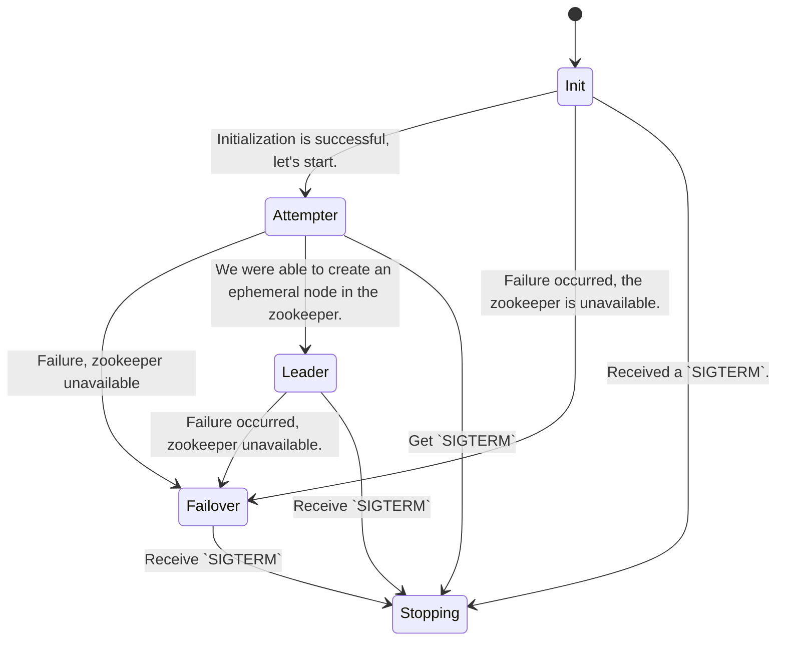

## Algorithm

The replica that becomes the leader writes a file to the `file-dir` directory every `leader-timeout` seconds and also
deletes old files if the number of files in the directory is greater than `storage-capacity`. ZooKeeper ephemeral nodes
are used to select the leader. The service is a state machine that changes its state depending on actions. The list of
states is as follows:

- `Init` - Initialization starts, checking the availability of all resources
- `Attemptempter` - Trying to become a leader - once in `attemptempter-timeout` we try to create an ephemeral node in
  the zookeeper.
- `Leader` - Once you become a leader, you need to write a file to disk.
- `Failover` - Something's broken, trying to fix itself.
- ``Stopping`` - Graceful shutdown - a state in which the application frees all its resources

## Configuration

The project is configured using flags on the command line.

- `zk-servers`(`[]string`) - An array with the addresses of the zukiper servers.
  Example: `--zk-servers=foo1.bar:2181,foo2.bar:2181`
- `leader-timeout`(`time.Duration`) - The frequency of the leader writing a zookeeper file to disk.
  Example: `--leader-timeout=10s`.
- `attempter-timeout`(`time.Duration`) - Periodicity with which the atempter tries to become a leader.
  Example: `--attemptempter-timeout=10s`.
- `file-dir`(`string`) - The directory where the leader should write files. Example: `--file-dir=/tmp/election`.
- `storage-capacity`(`int`) - Maximum number of files in the `file-dir` directory. Example: `--storage-capacity=10`.
